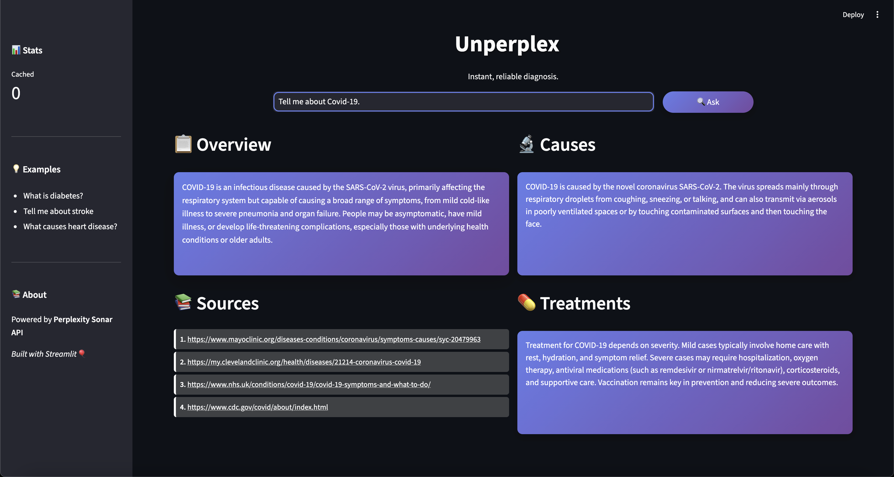

# unperplex

 

## Setup

Be sure to use a virtual environment:
> ```sh
> $ python3 -m venv venv
> ```
Here, `venv` is just an example, the virtual environment can be given *any* name.

To activate the virtual environment, run the following command:
> ```sh
> $ source venv/bin/activate
> ```

Upon activation, run `pip list`. Only `pip` and `setuptools` should be installed in the virtual environment.

To install requirements, run:
> ```sh
> $ pip install -r requirements.txt
> ```

Create a `.env` file:
To install requirements, run:
> ```sh
> $ touch .env
> ```

Add `PERPLEXITY_API_KEY` to the `.env`.